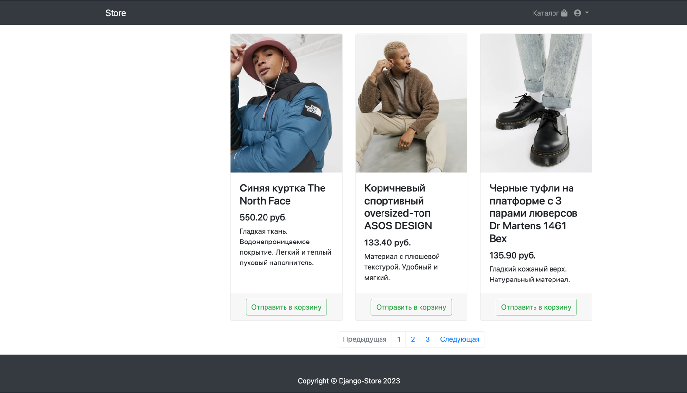

# Readme #
This Django project utilizes Redis for caching data and Celery 
for asynchronous task processing. The project also features integration with Stripe for payment processing, and includes a REST API for interacting with project data.

If you choose to launch the project without modifying the [ENV file](.env.example), email confirmations will be sent to the console, while Stripe webhook functionality will not be available. However, payments will still be processed successfully.

OAuth 2.0 works only with GitHub:) because of http connection

### REQUIREMENTS ###

* Python 3.10+ - https://www.python.org/downloads/
* Redis - https://redis.io/
* Postgres - https://www.postgresql.org
* Stripe CLI - https://stripe.com/docs/payments/checkout/fulfill-orders
* Docker (optional) - https://www.docker.com/

### Local Start ###

* Create Postgres DB:
```commandline
CREATE DATABASE store_db;
CREATE ROLE store_username with password "store_password";
ALTER ROLE "store_username" with LOGIN;
GRANT ALL PRIVILEGES ON DATABASE "store_db" TO store_username;
ALTER USER store_username CREATEDB;
```
* Install requirements and start server:
```commandline
python -m pip install -r requirements.txt
python manage.py makemigrations
python manage.py migrate
python manage.py loaddata users/fixtures/users.json
python manage.py loaddata products/fixtures/categories.json
python manage.py loaddata products/fixtures/goods.json
python manage.py loaddata store/fixtures/providers.json
python manage.py loaddata store/fixtures/sites.json
python manage.py runserver 127.0.0.1:8000
```
* Start Celery:
```commandline
celery -A store worker -l INFO
```
* Start Stripe:
```commandline
stripe listen --forward-to 127.0.0.1:8000/webhook/stripe/
```

### Docker Start ###

```commandline
docker-compose build
docker-compose up
```

### Installed Data ###

* Users:
```commandline
Admin: admin / 666555
User: test_user / 66665555a
```
* Card for successful payment (STRIPEs data):
```commandline
4242 4242 4242 4242
```
* Products and Categories
* [API collection](presentation/api_collection/store_api.json)

### Screenshots ###





